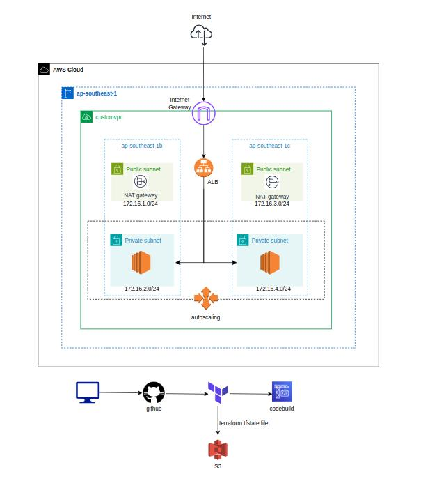

# Building AWS Architecture Ec2 with Load Balancer and Autoscaling using Terraform



Use S3 Bucket store terraform.tfstate file.
Please create s3 bucket and edit your S3 bucket name at 7-custom-instance.tf.
Make sure enable version control on terraform state files bucket

Also configure your aws cli profile using  ```aws configure --profile yourname```

```json
# store the terraform state file in s3
terraform {
  backend "s3" {
    bucket = "your-bucket-name"
    key = "state/terraform.tfstate"
    region = "ap-southeast-1"
    profile = "ahkcloud_admin"
    
  }
}
```

Please edit your Key Pairs name at variable.tf
```jason
variable "key_name" {
    default = "your-key-name"
}
```

For ci-cd, I use AWS CodeBuild.
